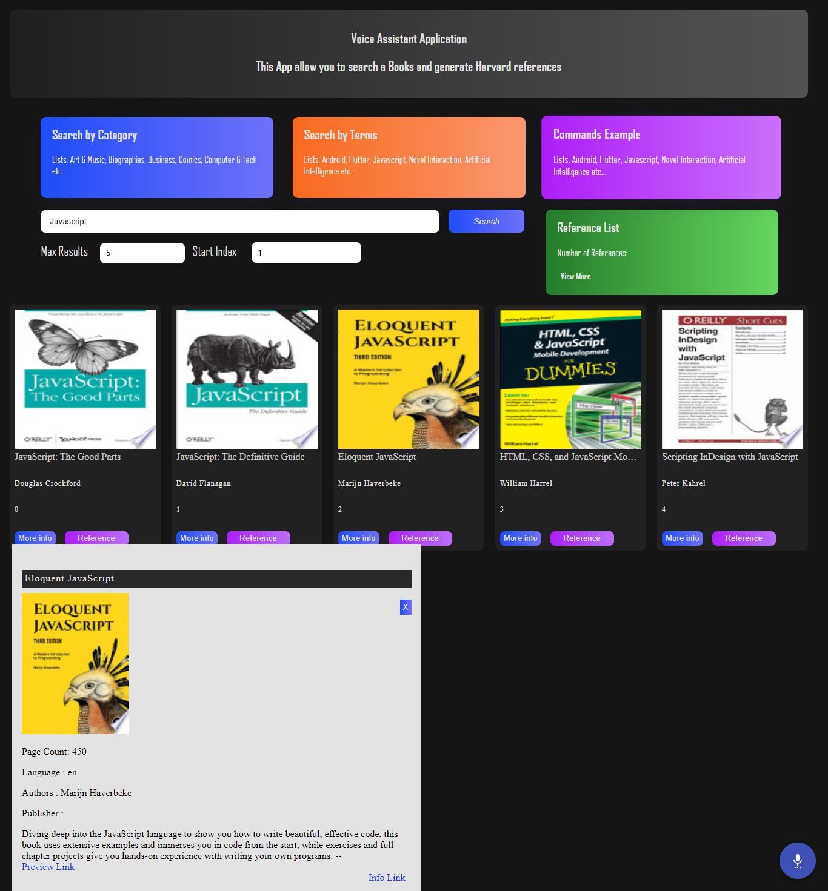

# React Voice Assistant Application

This project was bootstrapped with [Create React App](https://github.com/facebook/create-react-app).

## Description

Design, prototype and evaluate a Voice-based user interface that is designed to support Computer Science students access information relevant to their studies and to university life.
This application help students to find book using google books api and references the valid book in user commands.  

This could take many forms, but is likely to have some important features:

	- The user can control the system by issuing voice commands. 
	- The language of commands that a user is able to use may be complex.
	- The response to user commands may take a variety of forms, through speech, text, or some combination of the two.

**Google Book API**

###### Overview

The APIs in the [Google Books API](https://developers.google.com/books/docs/overview) Family let you bring Google Books features to your site or application. 
The new Google Books API lets you perform programmatically most of the operations that you can do interactively on the Google Books website.

## Alan AI

Alan platform provides an AI backends for your application to create conversational experiences.

[Alan git repo](https://github.com/alan-ai)

### Commands List

###### Search By Category

###### Search By Terms

###### Command Examples

## React

[React](https://reactjs.org/) is a javascript library use for building user interfaces.

[React git repo](https://github.com/facebook/react/)

## Screenshots

