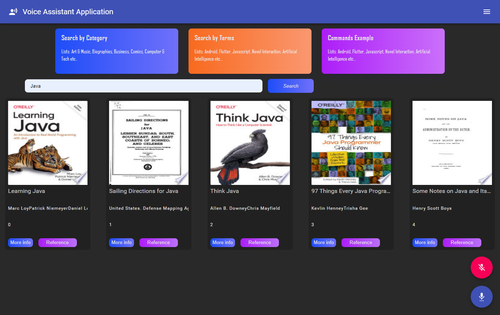

# React Voice Assistant Application

This project was bootstrapped with [Create React App](https://github.com/facebook/create-react-app).

## Alan AI

Alan platform provides an AI backends for your application to create conversational experiences.

[Alan git repo](https://github.com/alan-ai)

## React

[React](https://reactjs.org/) is a javascript library use for building user interfaces.

[React git repo](https://github.com/facebook/react/)

## Screenshots

